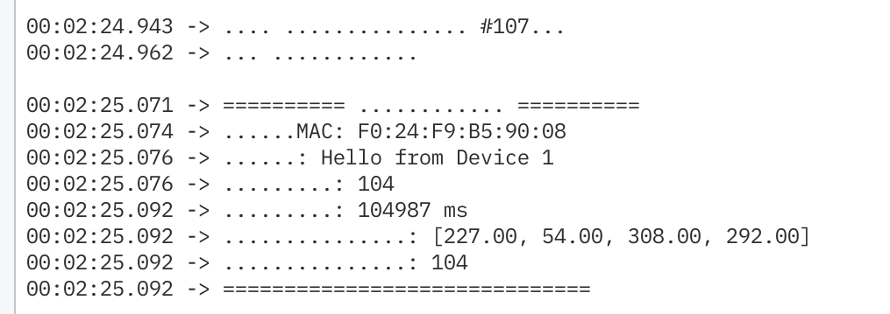
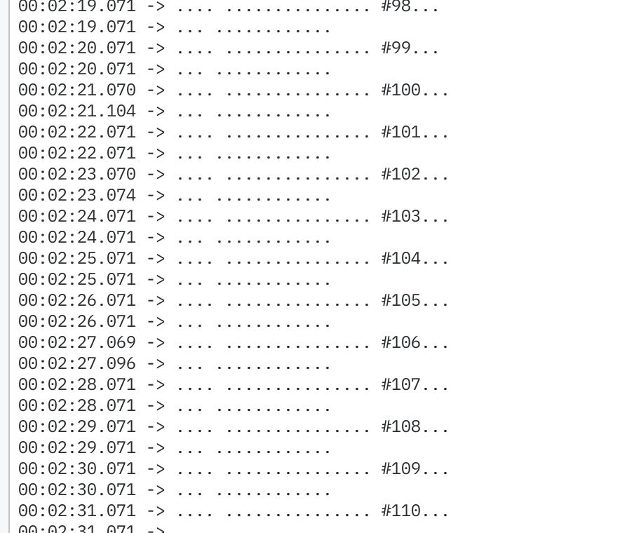

# ESP-NOW 双向通信使用说明

## 📝 简介

这是一个ESP-NOW双向通信示例，可以让两个ESP32设备互相发送和接收数据，无需路由器即可实现点对点通信。

## 🎯 功能特点

- ✅ 双向通信：两个设备可以互相发送和接收数据
- ✅ 自动发送：每秒自动发送一次数据包
- ✅ 手动发送：通过串口命令手动触发发送
- ✅ LED状态指示：不同颜色表示不同状态
- ✅ 蜂鸣器反馈：发送和接收时有声音提示
- ✅ 数据包括：文本消息、传感器数据、计数器、时间戳

## 🔧 配置步骤

### 第一步：获取MAC地址

1. 将代码上传到第一个ESP32
2. 打开串口监视器（115200波特率）
3. 记录显示的MAC地址，例如：`AA:BB:CC:DD:EE:F1` 智能电池板:F0:24:F9:B5:90:08 天线宝宝板:10:97:BD:12:ED:CC
4. 对第二个ESP32重复此操作，记录其MAC地址

### 第二步：修改代码

#### 设备1的配置

```cpp
// 第13行：设置为设备1
#define DEVICE_1  1

// 第24-26行：填入设备2的MAC地址
uint8_t peerMAC[] = {0xAA, 0xBB, 0xCC, 0xDD, 0xEE, 0xF2}; // 设备2的实际MAC
```

#### 设备2的配置

```cpp
// 第13行：设置为设备2
#define DEVICE_1  0

// 第29-31行：填入设备1的MAC地址
uint8_t peerMAC[] = {0xAA, 0xBB, 0xCC, 0xDD, 0xEE, 0xF1}; // 设备1的实际MAC
```

### 第三步：编译上传

1. 修改 `platformio.ini` 文件，临时更改源文件：

```ini
[env:pico32]
; ... 其他配置保持不变 ...

; 临时使用ESP-NOW测试代码
build_flags = 
    -D SRC_FILTER="+<../test/espnow_communication.cpp>"
```

或者直接将 `test/espnow_communication.cpp` 的内容复制到 `src/main.cpp`

2. 分别编译上传到两个ESP32设备

## 📊 LED状态指示

| 颜色 | 状态 |
|------|------|
| 🟠 橙色 | 启动中 |
| 🟡 黄色 | ESP-NOW初始化中 |
| 🟢 绿色 | 发送成功 / 系统就绪 |
| 🔵 蓝色 | 接收到数据 |
| 🟣 紫色 | 仅接收模式（对等设备未配置） |
| 🔴 红色 | 发送失败 / 初始化失败 |

## 🎵 蜂鸣器提示

- 启动时：三声上升音阶
- 接收数据：1000Hz短鸣一声
- 发送失败：500Hz短鸣一声
- 系统就绪：2000Hz短鸣一声

## 💻 串口命令

打开串口监视器（115200波特率），可以输入以下命令：

| 命令 | 功能 |
|------|------|
| `s` | 手动发送一次数据 |
| `i` | 显示设备信息（MAC地址、发送/接收计数等） |
| `r` | 重启ESP32 |
| `h` | 显示帮助信息 |

## 📡 数据包结构

```cpp
typedef struct {
    char message[32];      // 文本消息
    float sensor_data[4];  // 传感器数据（4个浮点数）
    uint32_t counter;      // 发送计数器
    uint32_t timestamp;    // 发送时间戳
} DataPacket;
```

## 🔍 串口输出示例

### 发送端
```
📤 发送数据包 #1...
✓ 发送成功
```

### 接收端
```
========== 收到数据 ==========
来自MAC: AA:BB:CC:DD:EE:F1
消息: Hello from Device 1
计数器: 1
时间戳: 5230 ms
传感器数据: [123.45, 67.89, 234.56, 89.01]
总接收次数: 1
==============================
```

## ⚙️ 参数调整

### 修改发送间隔

```cpp
// 第41行
const uint32_t SEND_INTERVAL = 1000; // 改为所需的毫秒数
```

### 修改传感器数据数量

```cpp
// 第21-24行，修改数组大小
typedef struct {
    char message[32];
    float sensor_data[8];  // 改为8个传感器
    uint32_t counter;
    uint32_t timestamp;
} DataPacket;
```

## 🔧 故障排查

### 问题1：发送失败

**可能原因：**
- 对方MAC地址填写错误
- 对方ESP32未开机或未运行ESP-NOW程序
- 距离太远（ESP-NOW有效范围约100-200米）

**解决方法：**
1. 检查MAC地址是否正确
2. 输入命令 `i` 查看配置信息
3. 将两个ESP32靠近测试

### 问题2：无法接收数据

**可能原因：**
- WiFi信道不一致
- ESP-NOW未正确初始化

**解决方法：**
1. 重启两个ESP32
2. 检查串口输出是否有错误信息

### 问题3：LED一直是紫色

**原因：** 对方MAC地址未配置（仍为默认值 FF:FF:FF:FF:FF:FF）

**解决方法：** 按照"配置步骤"正确填写对方MAC地址

## 🚀 进阶应用

### 整合到编码器项目

可以将ESP-NOW整合到现有的编码器读取代码中，实现：

1. 设备1读取编码器数据
2. 通过ESP-NOW发送给设备2
3. 设备2接收数据并处理

示例代码片段：

```cpp
// 在 loop() 中
if (millis() - lastSendTime >= SEND_INTERVAL) {
    // 读取编码器
    for (int i = 0; i < NUM_ENCODERS; i++) {
        sendData.sensor_data[i] = encoder_angles[i];
    }
    
    // 发送数据
    esp_now_send(peerMAC, (uint8_t*)&sendData, sizeof(sendData));
    lastSendTime = millis();
}
```

## 📚 参考资料

- [ESP-NOW官方文档](https://docs.espressif.com/projects/esp-idf/en/latest/esp32/api-reference/network/esp_now.html)
- [ESP32 Arduino Core](https://github.com/espressif/arduino-esp32)

## 💡 提示

- ESP-NOW不需要WiFi连接，但需要WiFi硬件开启
- 最多可以添加20个对等设备
- 数据包最大250字节
- ESP-NOW和WiFi可以同时使用，但会影响性能

---

**祝你使用愉快！如有问题，欢迎提Issue。**

设备2 天线宝宝板数据接收显示效果：


设备1 智能电池板发送数据效果：
